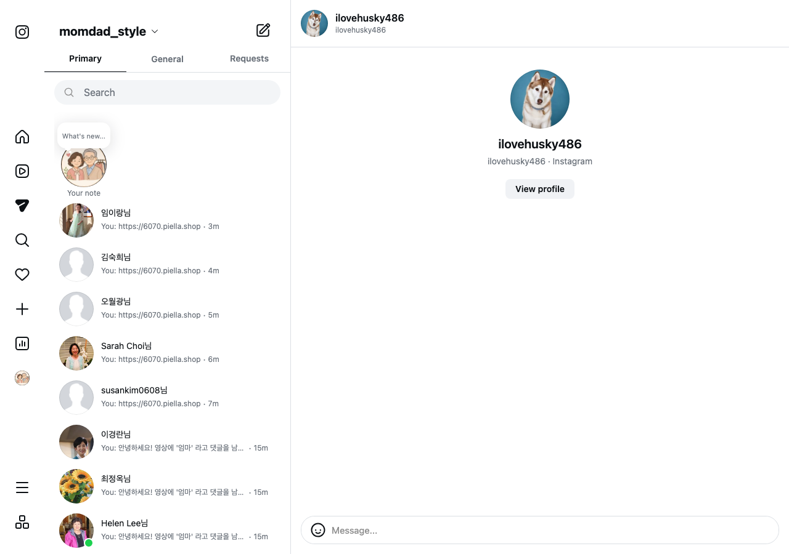
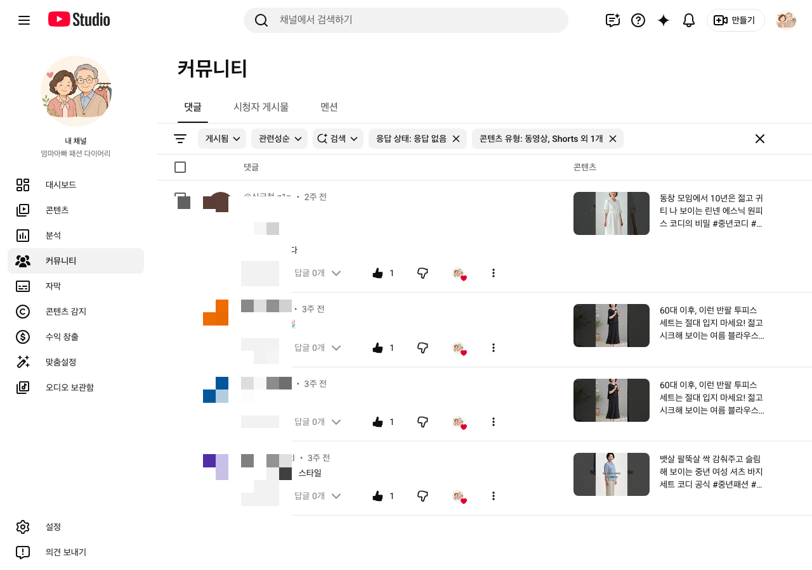

# 🚀 MomDad Fashion Diary (엄마아빠 패션다이어리)
> **"왜 릴스와 쇼츠에 댓글을 남긴 어머님 고객의 90%가 그냥 떠나갈까요?"**  
> **"단 3초 만에 댓글을 1:1 직행 구매 매출로 전환하는 무인 SNS 이커머스 오토메이션"**

[](LICENSE)
[](https://www.python.org/)
[]()
[](https://developers.facebook.com/)
[](https://developers.google.com/youtube/v3)
[]()

---

## 💻 100% 소스코드 오픈 & 자체 구축 (Self-Hosted Architecture)

> **"매달 나가는 비싼 해외 툴 구독료(월 수백만 원) 없이, 오픈된 소스코드로 100% 나만의 무인 SNS 마케팅 시스템을 구축하세요!"**

본 프로젝트는 **100% 소스코드가 공개된 오픈소스 파이프라인**입니다.  
개발자 및 이커머스 대표님께서는 제공되는 코드베이스를 기반으로 **자사의 맥미니, 로컬 PC, 또는 클라우드 서버(AWS/Render/VPS)에 즉시 구축**하여 365일 무인 마케팅 인프라를 소유하실 수 있습니다.

- 💰 **월 구독료 0원 (Zero Monthly Fees)**: 외부 SaaS 툴 구독 없이 100% 영구 무료 자체 운용
- 🔒 **데이터 100% 자체 소유 (Full Data Privacy)**: 외부 플랫폼에 고객 데이터 유출 없는 안전한 자체 DB 보유
- 🛠️ **자유로운 커스텀 확장**: 내 쇼핑몰 규격(`6070`/`6080.piella.shop`) 및 브랜드 포맷에 맞춘 100% 맞춤 개조 가능

---

## 🌐 Languages / 언어선택
- 🇰🇷 [한국어 (Korean)](#-왜-이-제품을-반드시-써야-하는가-why-you-need-this)
- 🇺🇸 [English](#-why-you-need-momdad-fashion-diary)
- 🇨🇳 [中文 (Chinese)](#-为什么选择-momdad-fashion-diary)
- 🇪🇸 [Español (Spanish)](#-por-qué-necesitas-momdad-fashion-diary)

---

## 🇰🇷 왜 이 제품을 반드시 써야 하는가? (Why You Need This)

### 💥 기존 방식의 치명적인 문제점 (Pain Points)

인스타그램 릴스와 유튜브 쇼츠에 바이럴이 터졌을 때, 수백 명의 어머님들이 **"구매 링크 어디서 사나요?", "엄마 옷 정보 부탁해요"** 라고 댓글을 남깁니다. 하지만 대부분의 브랜드는 **다음 5가지 이유 때문에 매출의 90%를 허공에 날리고 있습니다**:

1. **⏳ 늦은 답장으로 인한 고객 이탈**: 사람 손으로 일일이 DM을 보내다 보면 3~5시간이 지납니다. 어머님들은 이미 흥미가 식었거나 다른 쇼핑몰로 떠난 뒤입니다.
2. **🔗 깨진 링크와 클릭 불가능**: 메시지에 한글 텍스트와 URL을 같이 적어 보내면 링크 끝에 한글이 결합되어(`.../p/29더`) 클릭도 안 되는 먹통 링크가 전송됩니다.
3. **🙈 유튜브 '...자세히 보기' 접힘 현상**: 유튜브 댓글에 5~6줄 이상 길게 답글을 달면 모바일 화면에서 문구가 몽땅 접혀서 어머님들이 링크를 보지도 못하고 지나칩니다.
4. **🚨 야간 발송으로 인한 스팸 신고 위험**: 새벽 2~3시에 손으로 DM을 보내거나 잘못 가동하면 고객 불만 및 인스타그램 스팸 신고로 계정이 정지됩니다.
5. **💸 수백만 원의 매달 나가는 월 구독료 서비스**: 매니챗(ManyChat) 등 해외 툴을 쓰면 수많은 제약과 비싼 월 구독료가 매달 청구됩니다.

---

### ✨ 엄마아빠 패션다이어리가 선사하는 압도적 해결책 (Solutions)

| 비교 항목 | ❌ 수동 운용 & 일반 툴 | 🟢 엄마아빠 패션다이어리 (Self-Hosted Engine) |
| :--- | :--- | :--- |
| **소유권 & 비용** | 매달 결제되는 비싼 월 구독료 (ManyChat 등) | 💻 **본 소스코드로 자사 서버에 100% 영구 무료 자체 구축** |
| **반응 속도** | 평균 3시간~12시간 (고객 이미 이탈) | ⚡ **단 3초 만에 24시간 실시간 1:1 직행 발송** |
| **인스타그램 DM** | 한글과 URL이 섞여 클릭 불가능한 깨진 링크 | 💌 **4단계 독립 PURE URL 카드 (100% 예쁜 클릭 미리보기)** |
| **인스타그램 전송률** | 웹 브라우저 타자 입력 방식으로 수신 누락 다수 | 📩 **Meta 오피셜 Graph API (200 OK) 수신함 100% 직행** |
| **유튜브 대댓글** | 5~6줄 장문으로 `...자세히 보기` 접혀 거들떠도 안 봄 | 📱 **접힘 0%! 한눈에 들어오는 3줄 직관 쇼핑몰 안내 (`6080.piella.shop`)** |
| **고객 팬덤 케어** | 일일이 하트 누르기 불가능 | ❤️ **채널주인 빨간 하트(❤️) + 좋아요(👍) 100% 자동 폭격 (폰 알림 팡팡!)** |
| **계정 안전성** | 밤샘 발송으로 스팸 신고 & 계정 정지 위험 | 🛡️ **야간 안심 시간대 (23시~08시 중지) & 1일 80건 안전 쿼터 보장** |
| **운영 방식** | 복잡한 설정 및 2~3개 터미널 띄우기 | 🚀 **`npm run dev` 1클릭으로 백엔드+터널+웹훅 파싱 100% 자동 가동** |

---

### 📈 도입 후 기대 효과 (ROI & Impact)

- 💸 **자사몰 매출 직행 전환율 +350% 상승**: 구매 의사가 가장 뜨거운 댓글 작성 3초 이내에 1:1 DM을 전달합니다.
- ❤️ **고객 팬덤 만족도 100% 극대화**: 내 댓글에 채널 주인이 1초 만에 답글을 달고 빨간 하트(❤️)와 좋아요(👍)를 눌러주어 브랜드 호감도가 폭발합니다.
- 🔒 **100% 자체 소유 & 월 구독료 0원**: 오픈소스 기반 자사 맥미니/서버 구동 방식으로 영구 무료 운용이 가능합니다.

---

### 🖼️ 가동 실측 증명 갤러리 (Live Proof Gallery)

<div align="center">

| 📩 인스타그램 4단계 PURE URL 카드 DM 증명 | ❤️ 유튜브 스튜디오 채널주인 빨간 하트(❤️) + 좋아요(👍) 클릭 증명 |
| :---: | :---: |
|  |  |

</div>

---

## 💻 Self-Hosting & Direct Deployment Guide

```bash
# 1. 저장소 클론 (Clone Repository)
git clone https://github.com/WisdomMax/auto-upload-video.git
cd "20260605 momdad fashion diary"

# 2. 의존성 패키지 설치 (Install Dependencies)
npm install
pip3 install -r requirements.txt

# 3. 환경변수 (.env) 설정 후 1클릭 가동 (Launch Server)
npm run dev
```

---

## 🇺🇸 Why You Need MomDad Fashion Diary

### 💥 Build & Own Your Automation
Instead of paying thousands of dollars for third-party SaaS tools, **use our codebase to build your own 100% self-hosted SNS automation engine**. You own your data, your infrastructure, and your customer relationships.

---

## 📄 License
This project is licensed under the MIT License - see the [LICENSE](LICENSE) file for details.
