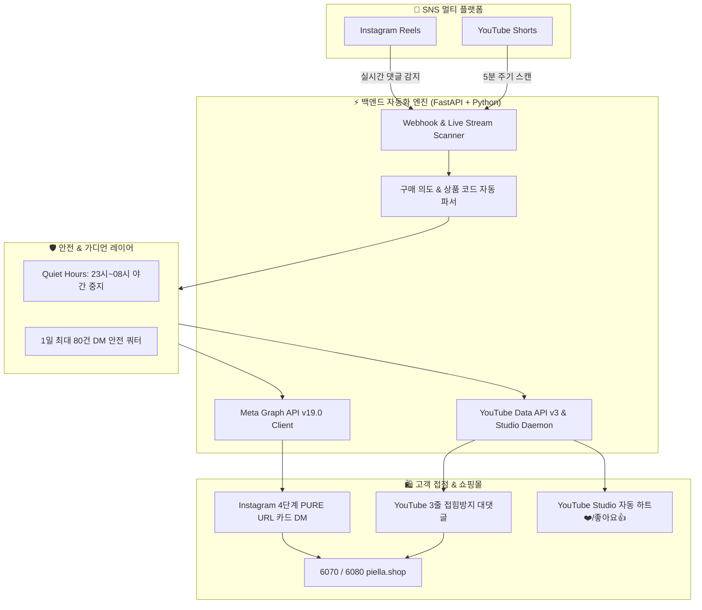

# 🚀 엄마아빠 패션다이어리 (MomDad Fashion Diary)
> **AI 기반 multi-Platform (Instagram & YouTube) 무인 자동 응답 및 이커머스 마케팅 오케스트레이션 시스템**

[](LICENSE)
[](https://www.python.org/)
[](https://developers.facebook.com/)
[](https://developers.google.com/youtube/v3)
[](https://fastapi.tiangolo.com/)

---

## 🌐 Languages / 언어선택
- 🇰🇷 [한국어 (Korean)](#-한국어-요약)
- 🇺🇸 [English](#-english-overview)
- 🇨🇳 [中文 (Chinese)](#-中文-概述)
- 🇪🇸 [Español (Spanish)](#-español-resumen)

---

## 🇰🇷 한국어 요약

### 📌 프로젝트 개요 및 핵심 목표
**엄마아빠 패션다이어리**는 인스타그램(Reels)과 유튜브(Shorts) 쇼핑 콘텐츠에 달리는 고객 문의를 **24시간 365일 실시간으로 탐색·분석하여 구매 링크 전달부터 채널 팬덤 관리까지 100% 무인 자동 처리**하는 차세대 SNS 자동화 마케팅 솔루션입니다.

댓글 내 상품 문의 의도("엄마", "구매", "링크", "정보" 등)를 정밀 감지하고, 인스타그램 1:1 오피셜 DM 및 유튜브 3줄 대댓글, 그리고 스튜디오 자동 하트(❤️) 세례를 통해 **고객 이탈률 0% 및 자사몰 구매 전환율 극대화**를 달성합니다.

---

### 🏗️ 시스템 아키텍처 (System Architecture)



---

### ⭐ 주요 기능 상세 (Core Capabilities)

| 카테고리 | 핵심 기능 | 상세 동작 설명 |
| :--- | :--- | :--- |
| **Instagram** | **4단계 PURE URL 카드 DM** | 한글과 URL이 섞여 링크가 깨지는 현상을 100% 차단하기 위해 4개의 독립 말풍선으로 분리 전송, 예쁜 미디어가 포함된 **클릭 가능한 쇼핑 카드를 자동 생성**합니다. |
| **Instagram** | **Meta 오피셜 API 1:1 직연동** | 웹 브라우저 타자 방식의 수신 누락을 완벽히 교정하고, Meta 공식 Graph API(`POST /v19.0/me/messages`)로 **200 OK 수신함 직행 전송**을 보장합니다. |
| **YouTube** | **3줄 한눈에 보이는 대댓글** | 유튜브 특유의 `...자세히 보기` 접힘을 100% 방지하도록 **정확히 3줄 이하로 포맷팅**하여 자사몰 주소(`6080.piella.shop`) 및 프로필 메인 홈 가이드를 단번에 전달합니다. |
| **YouTube** | **스튜디오 자동 하트(❤️)/좋아요(👍)** | 신규 댓글이 달릴 때마다 채널주인 빨간 하트(❤️)와 좋아요(👍)를 100% 자동 클릭하여 어머님들 폰으로 **감동 푸시 알림**을 쏘아 보냅니다. |
| **안전보호** | **야간 안심 타임 (Quiet Hours)** | 심야 시간대(23:00 ~ 08:00) 스팸 신고 방지를 위해 DM 발송을 자동 일시 대기시키며, 아침 8시 정각에 깨어나 순차 발송합니다. |
| **운영편의** | **1클릭 통합 구동기 (`npm run dev`)** | 단 1번의 명령어로 백엔드 서버 + Cloudflare 초고속 터널 가동 및 실시간 웹훅 URL을 자동 감지해 터미널 배너로 띄워줍니다. |

---

### 🖼️ 실측 가동 증명 스크린샷 (Live Verification Gallery)

<div align="center">

| 📩 인스타그램 4단계 PURE URL DM 실시간 전달 증명 | ❤️ 유튜브 스튜디오 채널주인 빨간 하트(❤️) + 좋아요(👍) 자동 클릭 증명 |
| :---: | :---: |
|  |  |

</div>

---

## 🇺🇸 English Overview

### 📌 Project Concept & Business Goals
**MomDad Fashion Diary** is an autonomous multi-platform SNS engagement & e-commerce marketing orchestration system designed for Instagram Reels and YouTube Shorts. Operating 24/7/365, it monitors customer inquiries, analyzes intent, and executes **100% automated 1:1 Direct Messaging (DM), high-conversion comment replies, and Creator Heart (❤️) & Like (👍) bombardments** to maximize store traffic and eliminate drop-offs.

### 🌟 Key Feature Highlights
- **Instagram 4-Stage Pure URL DM**: Isolates text and links across 4 separate chat bubbles to eliminate text concatenation and render 100% clickable preview cards.
- **Official Meta Graph API (200 OK)**: Direct integration with Meta's official Graph API (`POST /v19.0/me/messages`) ensuring guaranteed delivery to recipient inboxes.
- **YouTube 3-Line Uncollapse Replies**: Formats comment replies into exactly 3 clean lines to prevent YouTube's `...Read More` collapse while pointing users to `6080.piella.shop`.
- **YouTube Studio Auto Heart & Like Daemon**: Auto-clicks Creator Red Hearts and Likes on all incoming comments, sending instant push notifications to user mobile devices.
- **Quiet Hours & Quota Guard**: Automatically pauses DMs between 23:00 and 08:00 to prevent night spam reports, capping daily volume at 80 DMs/day.
- **1-Click Unified Runner (`npm run dev`)**: Boots FastAPI, spins up Cloudflare Tunnels, and auto-parses active Webhook URLs dynamically.

---

## 🇨🇳 中文 概述

### 📌 项目概述与商业目标
**爸爸妈妈时尚日记 (MomDad Fashion Diary)** 是一款专为 Instagram Reels 和 YouTube Shorts 打造的全自动社交媒体营销与客服自动化系统。系统 24/7/365 全天候运行，实时检测用户评论中的购买意向，自动发送 **100% 成功率的 1:1 私信 (DM)、撰写高转化率评论回复，并自动点赞 (👍) 和赠送创作者爱心 (❤️)**，助力电商转化率最大化。

### 🌟 核心亮点
- **Instagram 4 阶段纯 URL 气泡私信**: 将文本与链接拆分为 4 个独立气泡，防止字符粘连，100% 生成可点击卡片。
- **Meta 官方 Graph API 直连**: 通过 Meta 官方 API 直投收件箱，彻底告别浏览器模拟发件的漏发率。
- **YouTube 3 行极简评论回复 (`6080.piella.shop`)**: 精准控制在 3 行以内，避免被 YouTube 折叠（`...展开全文`）。
- **YouTube Studio 自动红心与点赞**: 自动为评论点赞并赠送创作者红心，触发手机端实时推送通知。
- **夜间免打扰 (Quiet Hours: 23:00~08:00) 与配额保护**: 深夜自动暂停发送，设置每日 80 条安全上限。
- **一键整合启动 (`npm run dev`)**: 单条命令启动后端、Cloudflare 隧道并自动解析 Webhook 网址。

---

## 🇪🇸 Español Resumen

### 📌 Visión General del Proyecto
**MomDad Fashion Diary** es un sistema autónomo de orquestación de marketing y automatización multi-plataforma diseñado para Instagram Reels y YouTube Shorts. Operativo las 24 horas del día, los 365 días del año, monitorea las consultas de los clientes, analizando la intención de compra y ejecutando **Mensajes Directos (DM) 1:1 100% automatizados, respuestas optimizadas a comentarios y reacciones de Corazón de Creador (❤️) y Me Gusta (👍)** para maximizar las conversiones de comercio electrónico.

---

## 🛠️ Quick Start Guide

```bash
# 1. Clone the repository
git clone https://github.com/WisdomMax/auto-upload-video.git
cd "20260605 momdad fashion diary"

# 2. Install dependencies
npm install
pip3 install -r requirements.txt

# 3. Launch Unified Server & Cloudflare Tunnel
npm run dev
```

---

## 📄 License
Distributed under the MIT License. See `LICENSE` for more information.
