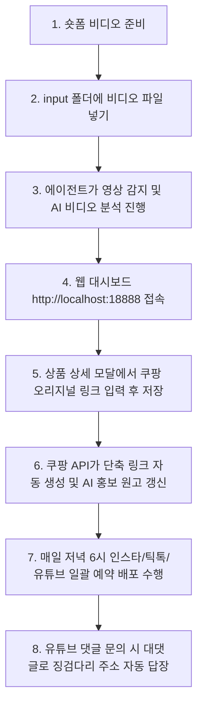

# 엄마아빠 패션다이어리 일일 운영 가이드

매일 작업을 시작할 때 이 가이드에 따라 진행하시면 됩니다.

## 1. 운영 순서도

## 2. 매일 수행할 핵심 체크리스트

- [ ] **1단계: 숏폼 비디오 업로드**
  - 편집이 완료된 mp4 비디오 파일을 프로젝트 루트의 `input` 폴더에 넣습니다.
  * 에이전트가 영상을 감지해 좌측 상단에 고유 코드를 합성하고, AI 분석을 통해 제목과 소개글 초안을 자동으로 등록합니다.
- [ ] **2단계: 쿠팡 파트너스 링크 매핑**
  - 브라우저로 대시보드(http://localhost:18888)에 접속합니다.
  - 새로 등록된 상품 카드의 상세 정보(수정 모달)를 열고 쿠팡 원본 URL을 입력한 뒤 저장합니다.
  * 쿠팡 API 키가 있으므로 저장하는 순간 자동으로 link.coupang.com 단축 주소가 발급되어 저장되고 이에 최적화된 마케팅 원고가 실시간 생성됩니다.
- [ ] **3단계: 배포 현황 확인 및 큐 비우기**
  - 대시보드에서 각 플랫폼별 뱃지(예약 완료 / 실패 여부)를 점검합니다.
  - Buffer API의 무료 요금제 한도(계정당 대기 포스트 최대 10개)로 인해 예약 실패가 뜰 경우, Buffer 대시보드 사이트에 접속하여 이전 대기 포스트를 비워줍니다.

## 3. 핵심 폴더 및 설정 점검

- **비디오 투입**: `input` 폴더 (스캔 대상)
- **완료 비디오**: `uploads/originals` 폴더
- **썸네일 저장**: `static/thumbnails` 폴더
- **웹 페이지 빌드**: `dist` 폴더
- **AI 및 API 설정**: `.env` 파일 (GEMINI_API_KEY, BUFFER_ACCESS_TOKEN, COUPANG_ACCESS_KEY, COUPANG_SECRET_KEY)
