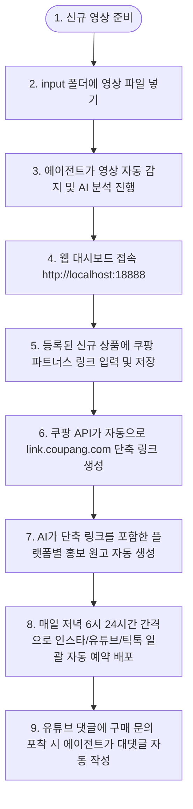

# 📖 Momdad Fashion Diary - Auto Marketing Agent Guide

이 파일은 시스템의 **완전 자동화 마케팅 파이프라인**을 에이전트(AI)가 술술 실행할 수 있도록 정의한 지침서이자 조율 매뉴얼입니다.

---

## 📂 폴더 구조 및 입출력 설계

* **`/input`** [NEW]: 사용자가 분석 및 오버레이할 원본 숏폼 비디오 파일을 밀어 넣는 스캔 대상 폴더.
* **`/uploads/originals`**: `ffmpeg`를 통해 고유 상품 코드가 입혀진 최종 비디오가 보관되는 폴더. (Buffer 및 R2 업로드에 사용).
* **`/static/thumbnails`** [NEW]: 영상의 전신샷 프레임이 9:16 webp 포맷으로 캡처 및 압축 저장되는 경로.
* **`/dist`**: 외부 사용자가 모바일로 접속할 정적 상품 카탈로그 홈페이지 빌드 대상 경로.

---

## 🤖 100% 논스톱 에이전트 실행 워크플로우

1시간 주기로 실행되는 에이전트 스케줄러(`agent_engine.py`)는 아래 단계에 맞춰 전체 프로세스를 한 번에 처리합니다.

### Step 1. 신규 영상 스캔 (`/input` 감지)
* `/input` 디렉토리에 새로운 `.mp4` 또는 `.mov` 영상 파일이 인입되는지 실시간 감지합니다.
* 신규 파일이 발견되면 에이전트 자동화 루프가 즉각 실행됩니다.

### Step 2. 비디오 AI 분석 및 상품 코드(알파벳+숫자 5자리) 결정
* **프레임 캡처**: `ffmpeg`를 사용해 영상의 0초, 5초, 10초 지점에서 프레임을 추출하여 `static/temp_frames`에 임시 저장합니다.
* **Gemini 멀티모달 분석**: 추출된 이미지 프레임들을 보고 에이전트가 모델의 옷 종류, 재질(린넨, 니트 등)을 분석하여 아래의 상품 코드 카테고리를 결정합니다:
  * **상의** -> `T` (T-shirt, Blouse 등)
  * **원피스** -> `D` (Dress)
  * **아우터** -> `O` (Outer)
  * **하의** -> `P` (Pants, Skirt)
  * **잡화/슈즈** -> `S` (Shoes, Bag 등)
* **상품 코드 발급**: DB의 동일 카테고리 최대치를 조회해 `최대 번호 + 1`로 발급합니다. (예: 원피스 첫 등록 시 `D00001` 발급).
* 분석된 옷 특징을 바탕으로 유튜브 제목/설명, SNS 캡션, DM 템플릿의 1차 초안을 작성하여 DB에 적재합니다.

### Step 3. ffmpeg 비디오 넘버링 자막 오버레이
* `ffmpeg`의 `drawtext` 필터를 이용하여, 비디오의 **왼쪽 상단 구석**에 이쁜 고딕체로 고유 상품 코드를 오버레이 자막으로 렌더링합니다:
  * 자막 텍스트: `Code: D00001`
  * 렌더링 후 영상 파일은 `/uploads/originals/` 경로에 저장하고 DB에 등록합니다.

### Step 4. webp 전신샷 썸네일 캡처
* 비디오의 최적 전신샷 프레임(보통 영상 중간 지점)을 캡처하여 **9:16 비율**로 크롭한 뒤, 용량이 가벼운 `webp` 형식으로 `static/thumbnails/{product_code}.webp`에 압축 저장합니다.

### Step 5. 정적 카탈로그 홈페이지 빌드 (`dist/`)
* 상품 코드 생성이 완료될 때마다 파이썬 빌더 스크립트가 실행되어 `dist/index.html`과 `dist/products.json`을 새로 빌드(SSG)합니다.
* **디자인 및 사용자 편의성**:
  * 모바일 기준 1열, PC 기준 4열 그리드. 폰에서 스위프(위아래 넘기기)하기 쉬운 레이아웃.
  * 상단에 검색창을 두어 유저가 상품 번호(예: `D00001`)로 다이렉트 검색하게 유도.
  * 상단 공지에 쿠팡 파트너스 수수료 면책 문구를 명시하여 상용화 대응.
  * 사진 클릭 시 매핑된 쿠팡 링크로 리다이렉트.

### Step 6. Buffer API를 통한 하루 1개 저녁 6시 예약 발행
* 영상이 쌓여 있는 경우, Buffer API로 배포할 때 하루에 딱 1개씩만 **매일 저녁 6시(18:00)** 기준 스케줄 예약을 누적하여 Buffer GraphQL `CreatePost`로 전송합니다.
* 예시: 3개가 대기 중이면 오늘 저녁 6시, 내일 저녁 6시, 모레 저녁 6시로 각각 24시간 간격 순차 스케줄 지정.

### Step 7. 유튜브 OAuth2 자동 대댓글 감지 및 답변 작성
* 1시간마다 에이전트가 내 유튜브 채널의 최신 댓글들을 긁어와서, 구매 문의 의도가 포착되면 해당 영상에 매핑된 상품 코드와 징검다리 주소를 결합하여 대댓글을 자동으로 다이렉트 등록합니다.
  * 예: `No. D00001 상품 정보 바로가기: http://yourdomain/p/D00001`
* 이를 위해 대시보드 폴더 내에 **`client_secrets.json`**을 준비하고, 최초 1회 인증 과정을 거쳐 **`token.json`**을 발급받아야 합니다.

---

## 매일 5분 일일 운영 가이드 및 순서도

에이전트가 24시간 백그라운드에서 상시 작동하므로, 운영자는 매일 아래의 간단한 순서에 맞춰 5분만 투자하시면 됩니다.

### 1. 일일 운영 프로세스 순서도

### 2. 매일 수행하는 일일 체크리스트

* **1단계: 영상 업로드**
  * 촬영 또는 편집이 완료된 숏폼 비디오(mp4 파일 등)를 input 폴더에 넣어둡니다.
  * 결과: 에이전트가 자동으로 영상을 감지하여 코드를 입히고, AI 분석을 통해 제목과 소개글을 초안으로 자동 등록합니다.
* **2단계: 대시보드 링크 매핑**
  * 브라우저에서 대시보드(http://localhost:18888)에 접속합니다.
  * 새로 등록된 상품 카드에서 '상세 정보(수정 모달)'를 클릭합니다.
  * 해당 제품의 쿠팡 파트너스 오리지널 링크를 붙여넣고 저장합니다. (쿠팡 API 키가 설정되어 있으므로 저장 시 자동으로 link.coupang.com 단축 링크가 발급 및 저장됩니다.)
* **3단계: 자동 배포 및 모니터링**
  * 매일 저녁 6시(18:00)가 되면 에이전트가 대기 중인 상품들을 인스타그램, 틱톡, 유튜브 쇼츠로 예약 발행을 자동으로 수행합니다.
  * 예약 완료 후 대시보드에서 각 플랫폼별 뱃지 상태(예약 완료 / 실패 여부)를 점검합니다.
