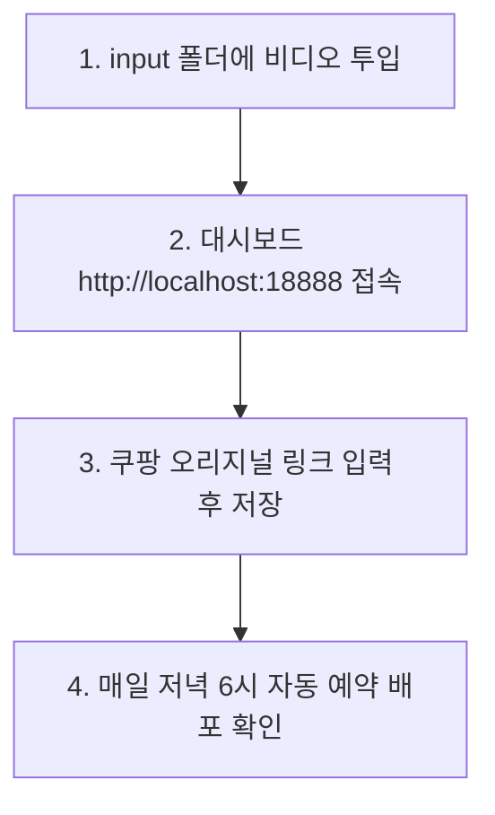

# 일일 운영 가이드

매일 이 가이드 순서에 맞춰 진행합니다.

## 1. 운영 순서도

## 2. 일일 체크리스트

- [ ] **1. 비디오 투입**
  - 편집된 mp4 비디오 파일을 `input` 폴더에 넣습니다.
- [ ] **2. 쿠팡 링크 매핑**
  - 대시보드(http://localhost:18888)에서 등록된 상품의 '쿠팡 링크'를 입력하고 저장합니다. (단축 링크 및 AI 캡션이 자동 생성됩니다.)
- [ ] **3. 예약 상태 확인**
  - 각 플랫폼별 배포 뱃지 상태(예약 완료 / 실패 여부)를 점검합니다.
  - Buffer 대시보드 한도(10개) 초과 시 기존 대기 포스트를 지워줍니다.

## 3. 핵심 디렉토리

- **비디오 넣는 곳**: `input/`
- **완료된 비디오**: `uploads/originals/`
- **설정 파일**: `.env`
