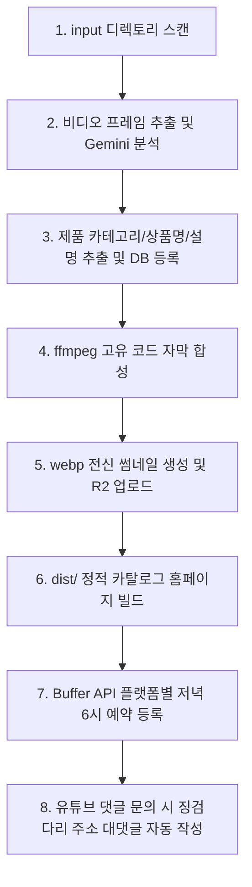

# 에이전트 실행 가이드

에이전트 scheduler는 매 루프마다 이 가이드 순서에 맞춰 백그라운드 작업을 실행합니다.

## 1. 에이전트 내부 순서도

## 2. 에이전트 핵심 태스크 체크리스트

- [ ] **1. 비디오 파일 감지 및 AI 분석**
  - `input/` 폴더의 신규 영상 감지 시, `ffmpeg`로 3장의 프레임을 캡처하여 Gemini API로 상품의 카테고리(T, D, O, P, S), 상품명, 상세 소개글을 자동 분석해 DB에 등록합니다.
- [ ] **2. 비디오 표준화 인코딩 및 자막 합성**
  - 1080x1920 세로 해상도로 규격을 맞추고 좌측 상단에 고유 코드를 합성하여 `uploads/originals/`에 저장합니다.
- [ ] **3. WebP 썸네일 추출**
  - 비디오 중간 지점(약 80% 구간)의 프레임을 캡처하여 9:16 비율 WebP 이미지로 `static/thumbnails/`에 저장합니다.
- [ ] **4. 정적 카탈로그 웹페이지 빌드**
  - 상품 정보가 변경되거나 생성될 때마다 `dist/index.html`과 `dist/products.json`을 새로 빌드(SSG)합니다.
- [ ] **5. Buffer API SNS 예약 배포**
  - 쿠팡 주소가 등록되고 배포 대기(`pending`) 상태인 상품들을 과거 등록순(ID 오름차순)으로 매일 저녁 6시 KST(18:00 KST) 기준으로 하루 1개씩 순차 예약 발행을 등록합니다.
- [ ] **6. 유튜브 댓글 감지 및 대댓글 작성**
  - 유튜브 댓글을 모니터링하여 구매 문의 감지 시, 비디오 코드와 매핑된 단축 징검다리 링크를 대댓글로 자동 게시합니다.

## 3. 리소스 디렉토리 및 설정

- **감지 대상**: `input/`
- **합성 완료 영상**: `uploads/originals/`
- **썸네일 경로**: `static/thumbnails/`
- **웹 빌드 대상**: `dist/`
- **토큰 및 API 키 설정**: `.env` (GEMINI_API_KEY, BUFFER_ACCESS_TOKEN, COUPANG_ACCESS_KEY, COUPANG_SECRET_KEY, YOUTUBE_API_KEY)
