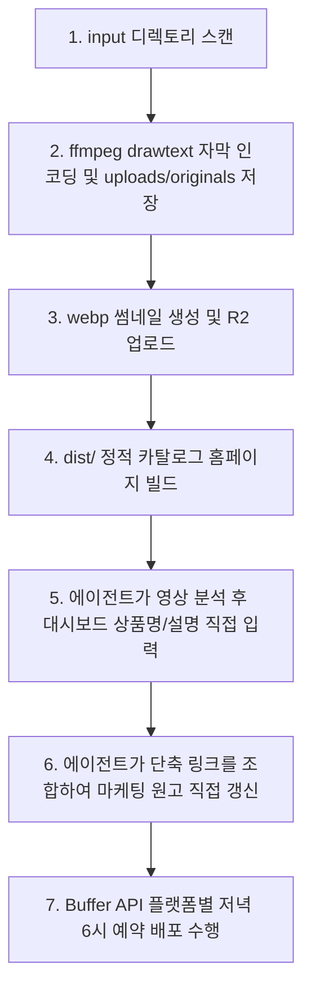

# 에이전트 실행 가이드

에이전트 scheduler는 매 루프마다 이 가이드 순서에 맞춰 백그라운드 작업을 실행합니다.

## 1. 에이전트 시스템 흐름도

## 2. 에이전트 핵심 태스크 체크리스트

- [ ] **1. 미디어 기본 가공 및 스캔**
  - input/ 폴더에 영상 감지 시, ffmpeg로 자막 코드 오버레이 인코딩을 진행하고 uploads/originals/에 저장하며, webp 썸네일을 생성합니다.
- [ ] **2. 에이전트(AI)의 영상 분석 및 주입**
  - 에이전트(나)가 직접 가공된 영상을 확인한 뒤, 제품 종류에 맞춰 상품 카테고리(T, D, O, P, S), 구체적인 상품명 및 상세 설명을 직접 대시보드 DB에 주입합니다.
- [ ] **3. 에이전트(AI)의 마케팅 원고 작성**
  - 사용자가 쿠팡 원본 URL을 입력하여 단축 주소가 생성되면, 에이전트(나)가 직접 독창적인 플랫폼별 홍보 원고를 작성하여 DB를 업데이트합니다.
- [ ] **4. Buffer API 자동 배포 예약**
  - 백그라운드 스케줄러가 매일 저녁 6시 KST(18:00 KST) 기준으로 하루 1개씩 대기 상태의 상품들을 인스타그램, 틱톡, 유튜브 쇼츠에 순차 예약 배포합니다.
- [ ] **5. 대댓글 자동 답변**
  - 백그라운드 스케줄러가 1시간 주기로 유튜브 댓글을 체크하고, 문의 포착 시 징검다리 주소가 결합된 답변 템플릿을 자동으로 답글 등록합니다.

## 3. 리소스 디렉토리

- **비디오 투입**: input/
- **합성 완료 영상**: uploads/originals/
- **썸네일 경로**: static/thumbnails/
- **웹 빌드 대상**: dist/
