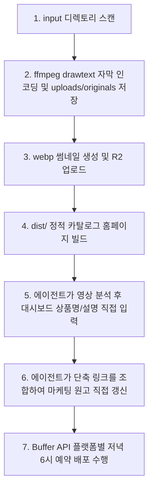

# 에이전트 실행 가이드

에이전트 scheduler는 매 루프마다 이 가이드 순서에 맞춰 백그라운드 작업을 실행합니다.

## 1. 에이전트 시스템 흐름도



## 2. 에이전트 핵심 태스크 체크리스트

- [ ] **1. 미디어 기본 가공 및 스캔**
  - input/ 폴더에 영상 감지 시, ffmpeg로 자막 코드 오버레이 인코딩을 진행하고 uploads/originals/에 저장하며, webp 썸네일을 생성합니다.
  - 모든 상품 코드는 카테고리 구분 없이 단일 접두사 T로 통일되어 순차적으로 발급됩니다 (T00001, T00002 등).
- [ ] **2. 에이전트(AI)의 영상 분석 및 주입**
  - 에이전트(나)가 직접 가공된 영상을 확인한 뒤, 제품의 구체적인 상품명 및 상세 설명을 직접 대시보드 DB에 주입합니다.
- [ ] **3. 에이전트(AI)의 마케팅 원고 작성**
  - 사용자가 쿠팡 원본 URL을 입력하여 단축 주소가 생성되면, 에이전트(나)가 직접 독창적인 플랫폼별 홍보 원고를 작성하여 DB를 업데이트합니다.
- [ ] **4. Buffer API 자동 배포 예약**
  - 백그라운드 스케줄러가 매일 저녁 6시 KST(18:00 KST) 기준으로 하루 1개씩 대기 상태의 상품들을 인스타그램, 틱톡, 유튜브 쇼츠에 순차 예약 배포합니다.
- [ ] **5. 대댓글 자동 답변**
  - 백그라운드 스케줄러가 1시간 주기로 유튜브 댓글을 체크하고, 문의 포착 시 징검다리 주소가 결합된 답변 템플릿을 자동으로 답글 등록합니다.

## 3. 리소스 디렉토리

- **비디오 투입**: input/
- **합성 완료 영상**: uploads/originals/
- **썸네일 경로**: static/thumbnails/
- **웹 빌드 대상**: dist/

## 4. 정적 카탈로그 자동 배포 (GitHub Pages / Cloudflare Pages)

- 정적 카탈로그 웹페이지(`dist/index.html`, `dist/products.json`, `static/thumbnails/`)는 새로운 영상 스캔 및 단축 링크 발급 시 자동으로 Git Push를 수행하여 웹사이트에 배포됩니다.
- 백그라운드 환경에서 인증 팝업 없이 깃 푸시가 정상 작동하려면, 발급받은 GitHub Personal Access Token (PAT)을 `.env` 파일에 `GITHUB_TOKEN=ghp_...` 형태로 등록해 두어야 무인 자동 배포가 완료됩니다.

---

## 5. Antigravity Agent 수동 작업 가이드라인 (명령어: "start.md 보고 진행해")

사용자가 대화창에 `"start.md 보고 진행해"` 또는 이와 유사한 지시를 내리면, Antigravity Agent는 즉시 다음의 백엔드 데이터 프로세싱 및 작문 태스크를 직접 실행합니다. (유료 Gemini API 호출 대신, 에이전트의 지능을 무상 활용하여 고품질의 캡션을 작문하고 DB를 직접 갱신하는 시나리오입니다.)

### [실행 프로세스]

1. **DB 미완료 상품 감지 및 스캔**:
   - 프로젝트 내 `database.py` 라이브러리를 임포트하여 현재 등록된 상품 리스트를 가져옵니다.
   - 아직 SEO 최적화 작문이 적용되지 않은 미완료 상품을 스캔하고, 이미 완료된 상품과 분류하여 현황을 파악합니다.
   - **[SEO 미완료 판정 기준]**:
     * 유튜브 제목(`youtube_title`)이 비어 있거나 디폴트 텍스트인 경우.
     * 유튜브 제목이 이전의 고정 템플릿 패턴(`"60대 이후 옷 잘 입는..."`, `"60대 어머님들..."`, `"60대 이후 입으면..."`, `"60대 70대 어머님들..."` 등)으로 시작하여 에이전트의 개별 작문이 적용되지 않은 경우.
     * 유튜브 설명글(`youtube_description`)에 상품에 대한 다정한 코디/스토리 멘트가 없이 기본 대체 문구만 적혀 있는 경우.
   - 필터링용 파이썬 스니펫 예시:
     ```python
     import database
     items = database.get_items()
     pending_items = []
     default_prefixes = ["60대 이후 옷 잘 입는", "60대 어머님들", "60대 이후 입으면", "60대 70대 어머님들"]
     for item in items:
         title = item.get("title") or ""
         yt_title = item.get("youtube_title") or ""
         yt_desc = item.get("youtube_description") or ""
         
         is_empty = not yt_title or not yt_desc
         is_default_title = any(yt_title.startswith(p) for p in default_prefixes) or "엄마아빠 패션다이어리" in yt_title or "추천 상품" in yt_title
         is_default_desc = "에이전트가 영상 분석을 통해" in yt_desc or "에이전트가 추천한" in yt_desc or not yt_desc
         
         if is_empty or is_default_title or is_default_desc:
             pending_items.append(item)
     ```

2. **에이전트(나)의 지능을 사용한 직접 작문**:
   - 스캔된 각 미완료 상품의 원래 제목(`title`)과 사용자가 대시보드에 기입한 추가 설명(`description`), 그리고 단축 구매 링크(`short_url` 또는 `coupang_url`)를 확보합니다.
   - 60대 이상 시니어 타겟팅 패션 채널인 '엄마아빠 패션다이어리'에 최적화된 마케팅 텍스트들을 **에이전트의 추론 능력을 발휘하여 직접 창작**합니다.
   
   ⚠️ **[노출 극대화 및 알고리즘 검열 회피 작문 수칙 - 필수 준수]**
   - **광고/상업성 노골적 배제**: 제목이나 설명글 맨 상단에 "쿠팡 추천템", "사러가기", "특가 할인", "초특가" 등의 상업적인 단어나 유도성 멘트를 대놓고 작성하지 않습니다. AI 플랫폼 검열에서 상업적 스팸 채널로 분류되어 노출량이 극도로 억제되는 것을 방지하기 위함입니다.
   - **유익한 정보 제공형 코디/스토리 멘트 구성**: 시청자가 검색하고 찾아볼 만한 가치 있는 코디 노하우, 체형 보정 방법, 시니어 연령대별 스타일링 팁을 텍스트 앞단에 자연스럽게 배치합니다.
     * *예시*: "60대 이후에는 어깨 처짐이나 군살이 신경 쓰여서 어떤 상의를 입어도 촌스러워 보이기 십상이죠? 오늘은 어깨 선을 세련되게 잡아주면서도 몸매가 20년은 젊어 보일 수 있는 쿨 린넨 가디건 연출 팁을 소개해 드립니다..." 와 같이 독자에게 정보로서 유익하게 와닿도록 씁니다.
     
   - **플랫폼별 상세 사양 작성 가이드**:
     * **유튜브 제목**: **[실전 조회수 대박 공식 4대 패턴]** 중 상품 특성에 가장 알맞은 하나를 선택하여 작문합니다. 제목에는 일련번호(No.X)와 구식 트렌드인 `#Shorts`를 절대 기재하지 않고, 핵심 카테고리 해시태그 2~3개를 끝에 덧붙입니다.
       1. **불안/부정 후킹형 (가장 강력함)**: 시니어들의 실패 방지 심리 자극
          - 패턴: `~세 이후 입으면 10년 늙어 보이는 {상품명} 5가지`, `~대 이후, 이런 {상품명}은 절대 사지 마세요!`, `아무리 추워도/더워도 이 {상품명}은 제발 피하세요`
       2. **호기심/귀티 유발형**: 중년 여성들의 세련됨, 격식 심리 자극
          - 패턴: `{상품명} 하나로 귀티 나는 코디의 비밀`, `단체사진에서 백배 화사하게 빛나는 {상품명} 연출법`, `백화점 직원은 절대 말해주지 않는 {상품명}의 특징`
       3. **체형/고민 해결형**: 시니어들의 신체적 콤플렉스(뱃살, 무릎 통증) 해결 제시
          - 패턴: `키 작은 중년 여성 이것만 알면 5cm 더 커 보여요!`, `뱃살/팔뚝살 싹 감춰주고 슬림해 보이는 {상품명} 코디 공식`, `하루 만 보 걸어도 무릎 발 안 아픈 {상품명} 추천`
       4. **또래 증명/신뢰형**: 대중적이고 검증된 트렌드 강조
          - 패턴: `옷 잘 입는 60대들은 꼭 지키는 {상품명} 코디 비법`, `50대 60대 엄마들이 신는 순간 극찬한 {상품명}`
     * **유튜브 설명글**: 어머님/아버님들을 위해 매우 다정하고 상냥한 경어체(~해요, ~합니다)로 작성하며, 상품 특징 및 사용자 추가 설명(`description`)의 디테일을 자연스럽게 녹여내고, 하단에 쿠팡 파트너스 수수료 고지 문구를 필수 기재합니다.
     * **유튜브 태그**: 샵 기호 없는 콤마 구분 키워드 5~8개.
      * **SNS 캡션 (인스타그램, 틱톡 본문)**: 기계적인 템플릿(No.X, 상품명 단순 나열)을 철저히 배제하고, 독자(50대~70대 시니어)의 감정을 자극하는 이야기 구조로 작성합니다.
        1. **공감 및 고민 자극형 오프닝 (1~2줄)**: 유튜브 제목 4대 공식을 인스타그램 캡션 도입부에도 녹여냅니다. (예: "나이 들수록 팔뚝살 때문에 반팔 하나 입기도 신경 쓰이시죠?", "모임에서 유독 우아하고 세련돼 보이는 어머님들의 코디 비밀을 공유합니다! ✨")
        2. **다정한 코디 스토리 설명 (3~4줄)**: 스팸 광고 느낌이 나지 않도록 코디 방법, 소재의 특성(예: '살에 달라붙지 않아 에어컨을 입은 듯 시원한 인견 소재'), 체형 커버 노하우를 시니어 눈높이에 맞춰 상냥하게 (~해요, ~랍니다) 서술합니다.
        3. **댓글 참여 유도 (CTA)**: "이 제품의 자세한 정보와 구매 링크를 받아보고 싶으신 어머님들은 댓글에 편하게 '엄마'라고 남겨주세요! 💌 확인하는 대로 DM으로 즉시 구매 링크를 전송해 드릴게요!" 형태로 매끄럽게 연결합니다.
        4. **트렌디한 시니어 패션 해시태그 배치 (맨 하단)**: `#시니어패션 #중년코디 #엄마옷추천 #동안패션 #5060패션 #체형커버코디` 등 카테고리에 맞는 자연스러운 태그 5~7개를 덧붙입니다.
     * **우회 댓글 답글**: 네이버 검색창에 '엄마아빠 패션다이어리 {상품명}' 검색을 유도하는 우회 멘트를 구성합니다.

3. **DB 직접 업데이트 실행**:
   - 작문이 끝난 텍스트 데이터를 DB에 업데이트하기 위해, 에이전트(나)가 직접 파이썬 일회성 코드를 작성하여 터미널 명령(`run_command`)으로 가동시킵니다.
   - 실행용 파이썬 스니펫 예시:
     ```python
     import database
     database.update_item_generated_contents(
         item_id=123,
         youtube_title="...",
         youtube_description="...",
         youtube_tags="...",
         sns_caption="...",
         dm_template="...",
         comment_reply="..."
     )
     ```

4. **카탈로그 페이지 갱신 빌드**:
   - 데이터 업데이트 후 정적 페이지를 최신화하기 위해 `run_command`로 `catalog_builder`를 가동합니다.
     ```python
     import catalog_builder
     catalog_builder.build_catalog()
     ```

5. **사용자에게 요약 보고**:
   - 작업 완료 후, 새로 갱신된 상품 번호와 직접 작문한 유튜브 제목 목록을 대화창에 깔끔하게 요약하여 보고합니다.

